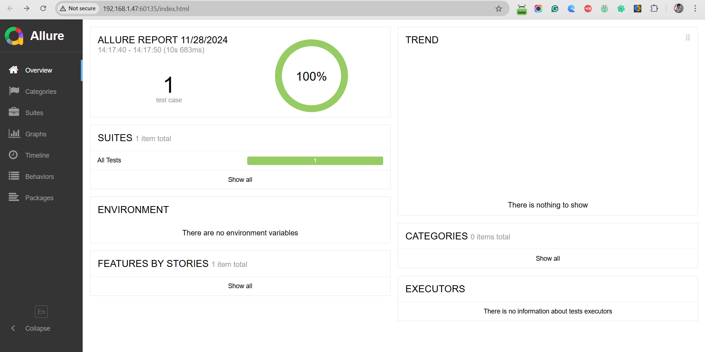

# Fetching the Data from an API Project

## Overview
This project automates database validation and endpoint testing using **TestNG**, **RestAssured**, and **Allure** for reporting. The test ensures data fetched from the API is validated against the database.

---

## Prerequisites
1. **Java Development Kit (JDK)**: Version 11 or higher.  
   Check installed version with:
   ```bash
   java -version

2. **Configure Apache Maven**: mvn -version

3. **Added required Dependencies like testNG, RestAssured, SQL and Json** 

## RUN TEST
**Run the tests using Maven**: mvn test

## Allure Report
**Generate the Allure report**: allure serve allure-results 


## Dependencies
The project uses the following libraries:

RestAssured: For API testing.
TestNG: For test execution.
Allure: For generating detailed reports.
JDBC: For database connections.